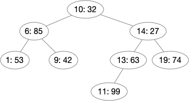

# Binary Search Trees

This is the seventh blog post in a
[series](https://siek.blogspot.com/2024/06/data-structures-and-algorithms-correctly.html)
about developing correct implementations of basic data structures and
algorithms using the [Deduce](https://github.com/jsiek/deduce)
language and proof checker.

This post continues on the theme of binary trees, that is trees in
which each node has at most two children. The focus of this post is to
develop a correct binary search tree data structure. That is, we are
going to implement a data structure that supports searching for a
value based on its associated key. The data structure will also
support inserting new values. We will store the keys and their values
in a binary tree and implement `BST_search` and `BST_insert` operations.
These operations are efficient (logarithmic time) when the binary tree
is balanced, but we will save how to balance trees for a later blog
post.

The main idea of a binary search tree comes from the notion of binary
search on a sequence, that is, keep the sequennce in sorted-order and
when searching for a key, start in the middle and go left by half of
the subsequence if the key you're looking for is less than the one at
the current position; go right by half of the subsequence if the key
is greater than the one at the current position. Of course, if they
are equal, then you've found what you're looking for. Thus, binary
search is just like looking up the definition of a word in a
dictionary. The word is your key and the dictionary is sorted
alphabetically. You can start in the middle and compare your word to
those on the current page, then flip to the left or right depending on
whether your word is lower or higher in the alphabet.

The binary search tree adapts the idea of binary search from a
sequence to a tree.  Each node in the tree stores a key and its
value. The left subtree of the node contain keys that are less than
the node and the right subtree contain keys that are greater than the
node. Thus, when searching for a key, one can compare it to the
current node and then either go left or right depending on whether the
key is less-than or greater-than the current node.

Consider the following diagram of a binary search tree. For
simplicity, we will use numbers for both the keys and the values.
In this diagram the key is listed before the colon and the value
is after the colon. For example, this tree contains 

* key `10` associated with value `32`, 
* key `13` associated with value `63`,
* etc.



The following code builds this binary search tree
using the `Tree` union type defined in the
[Binary Tree](https://siek.blogspot.com/2024/07/binary-trees-with-in-order-iterators.html) 
blog post and the `Pair` type from the `Pair.pf` file.

```{.deduce #BST1}
define BST_1 = TreeNode(EmptyTree, pair(1, 53), EmptyTree)
define BST_9 = TreeNode(EmptyTree, pair(9, 42), EmptyTree)
define BST_6 = TreeNode(BST_1, pair(6, 85), BST9)
define BST_11 = TreeNode(EmptyTree, pair(11, 99), EmptyTree)
define BST_13 = TreeNode(BST_11, pair(13, 69), EmptyTree)
define BST_19 = TreeNode(EmptyTree, pair(19, 74), EmptyTree)
define BST_14 = TreeNode(BST_13, pair(14, 27), BST_19)
define BST_10 = TreeNode(BST_6, pair(10, 32), BST_14)
```

There are three operations in the binary search tree interface with
the following specifications.

* The `EmptyTree` constructor from the `Tree` union type, which
  builds a tree that does not contain any key-value associations.
  
* `BST_insert : fn Tree<Pair<Nat,Nat>>, Nat, Nat -> Tree<Pair<Nat,Nat>>` 

  The operation `BST_insert(T, k, v)` produces a new tree that
  associates value `v` with key `k` and for all other keys,
  associates keys with the values according to tree `T`.

* `BST_search : fn Tree<Pair<Nat,Nat>>, Nat -> Option<Nat>`

  The operation `BST_search(T, k)` returns `just(v)` if `v` is the
  value associated with key `k` in tree `T`, and otherwise returns
  `none`.


```{.deduce #all_nodes}
function all_nodes<E>(Tree<E>, fn E -> bool) -> bool {
  all_keys(EmptyTree, P) = true
  all_keys(TreeNode(L, x, R), P) = all_nodes(L, P) and P(x) and all_nodes(R, P)
}
```

```{.deduce #is_BST}
function is_BST(Tree<Pair<Nat,Nat>>) -> bool {
  is_BST(EmptyTree) = true
  is_BST(TreeNode(L, kv, R)) = 
      define k = first(kv) define v = second(kv)
      all_nodes(L, λl{ first(l) < k }) and all_nodes(R, λr{ first(r) > k })
      and is_BST(L) and is_BST(R)
}
```

```{.deduce #BST_search}
function BST_search(Tree<Pair<Nat,Nat>>, Nat) -> Option<Nat> {
  BST_search(EmptyTree, k) = none
  BST_search(TreeNode(L, x, R), k) =
    if k = first(x) then
      just(second(x))
    else if k < first(x) then
      BST_search(L, k)
    else
      BST_search(R, k)
}
```

```{.deduce #BST_insert}
function BST_insert(Tree<Pair<Nat,Nat>>, Nat, Nat) -> Tree<Pair<Nat,Nat>> {
  BST_insert(EmptyTree, k, v) = TreeNode(EmptyTree, pair(k, v), EmptyTree)
  BST_insert(TreeNode(L, x, R), k, v) =
    if k = first(x) then
      TreeNode(L, pair(k, v), R)
    else if k < first(x) then
      TreeNode(BST_insert(L, k, v), x, R)
    else
      TreeNode(L, x, BST_insert(R, k, v))
}
```

## Test

```{.deduce #testBstSearch}

assert BST_search(EmptyTree, 5) = none

assert BST_search(BST_1_53, 1) = just(53)
assert BST_search(BST_1_53, 2) = none
```


<!--
```{.deduce file=BinarySearchTree.pf} 

import BinaryTree

<<all_nodes>>
<<is_BST>>
<<BST_search>>
<<BST_insert>>

```

```{.deduce file=BinarySearchTreeTest.pf} 
import BinarySearchTree

<<BST1>>
<<testBstSearch>>

```
-->


