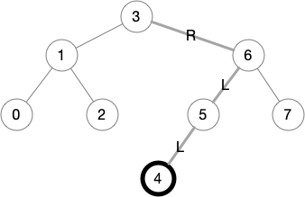

# Binary Trees with In-order Iterators

This is the fifth blog post in a
[series](https://siek.blogspot.com/2024/06/data-structures-and-algorithms-correctly.html)
about developing correct implementations of basic data structures and
algorithms using the [Deduce](https://github.com/jsiek/deduce)
language and proof checker.

In this blog post we study binary trees, that is, trees in which each
node has at most two children. We study the in-order tree traversal,
as that will become important when we study binary search trees.
Furthermore, we implement tree iterators that keep track of a location
within the tree and can move forward with respect to the in-order
traversal.

## Binary Trees

We begin by defining a `union` for binary trees:

```{.deduce #Tree}
union Tree<E> {
  EmptyTree
  TreeNode(Tree<E>, E, Tree<E>)
}
```

For example, we can represent the following binary tree 


with a bunch of tree nodes like so:

```{.deduce #BinaryTree05}
define T0 = TreeNode(EmptyTree, 0, EmptyTree)
define T2 = TreeNode(EmptyTree, 2, EmptyTree)
define T1 = TreeNode(T0, 1, T2)
define T4 = TreeNode(EmptyTree, 4, EmptyTree)
define T5 = TreeNode(T4, 5, EmptyTree)
define T7 = TreeNode(EmptyTree, 7, EmptyTree)
define T6 = TreeNode(T5, 6, T7)
define T3 = TreeNode(T1, 3, T6)
```

We define the height of a tree with the following recursive function.

```{.deduce #height}
function height<E>(Tree<E>) -> Nat {
  height(EmptyTree) = 0
  height(TreeNode(L, x, R)) = suc(max(height(L), height(R)))
}
```

The example tree has height `4`.

```{.deduce #test_height}
assert height(T3) = 4
```

We count the number of nodes in a binary tree with the `num_nodes`
function.

```{.deduce #num_nodes}
function num_nodes<E>(Tree<E>) -> Nat {
  num_nodes(EmptyTree) = 0
  num_nodes(TreeNode(L, x, R)) = suc(num_nodes(L) + num_nodes(R))
}
```

The example tree has `8` nodes.

```{.deduce #test_num_nodes}
assert num_nodes(T3) = 8
```

## In-order Tree Traversal

Now for the main event of this blog post, the in-order tree traversal.
The idea of this traversal is that for each node in the tree, we
follow this recipe:

1. process the left subtree
2. process the current node
3. process the right subtree

What it means to process a node can be different for different
instantiations of the in-order traversal. But to make things concrete,
we study an in-order traversal that produces a list. So here is our
definition of the `in_order` function.

```{.deduce #in_order}
function in_order<E>(Tree<E>) -> List<E> {
  in_order(EmptyTree) = empty
  in_order(TreeNode(L, x, R)) = append(in_order(L), node(x, in_order(R)))
}
```

The result of `in_order` for `T3` is the list `0,1,2,3,4,5,6,7`.
As you can see, we chose the data values in `T3` to match their position 
within the in-order traversal.

```{.deduce #test_in_order}
assert in_order(T3) = interval(8, 0)
```

## In-order Tree Iterators

A tree iterator keeps track of a position with a tree.  Our goal is to
create a data structure to represent a tree iterator and also to
implement the following operations on iterators, which we describe in
the following paragraph.

```
ti2tree : < E > fn TreeIter<E> -> Tree<E>
ti_first : < E > fn Tree<E>,E,Tree<E> -> TreeIter<E>
ti_get : < E > fn TreeIter<E> -> E
ti_next : < E > fn TreeIter<E> -> TreeIter<E>
ti_index : < E > fn(TreeIter<E>) -> Nat
```

* The `ti2tree` operator returns the tree that the iterator is traversing.

* The `ti_first` operator returns an itereator pointing to the first
  node (with respect to the in-order traversal) of a non-empty tree.  We
  represent non-empty trees with three things: the left subtree, the
  data in the root node, and the right subtree.

* The `ti_get` operator returns the data of the node at the current position.

* The `ti_next` operator moves the iterator forward by one position.

* The `ti_index` operator returns the position of the iterator as a natural number.

Here is an example of creating an iterator for `T3` and moving it forward.

```{.deduce #test_first_get}
define iter0 = ti_first(T1, 3, T6)
assert ti_get(iter0) = 0
assert ti_index(iter0) = 0

define iter3 = ti_next(ti_next(ti_next(iter0)))
assert ti_get(iter3) = 3
assert ti_index(iter3) = 3

define iter7 = ti_next(ti_next(ti_next(ti_next(iter3))))
assert ti_get(iter7) = 7
assert ti_index(iter7) = 7
```

### Iterator Representation

We represent a position in the tree by recording a path of
left-or-right decisions. For example, to represent the position of
node `4` of the example tree, we record the path `R,L,L` (`R` for
right and `L` for left).



When we come to implement the `ti_next` operation, we will sometimes
need to climb the tree. For example, to get from `4` to `5`.  To make
that easier, we will store the path in reverse. So the path to node
`4` will be stored as `L,L,R`.

It would seem natural to store an iterator's path separately from the
tree, but doing so would complicate many of the upcoming proofs
because only certain paths make sense for certain trees.  Instead, we
combine the path and the tree into a single data structure called a
*zipper* (Huet, The Zipper, Journal of Functional Programming,
Vol 7. Issue 5, 1997). The idea is to attach extra data to the left
and right decisions and to store the subtree at the current position.
So we define a `union` named `Direction` with constructors for left
and right, and we define a union named `TreeIter` that contains a path
and the non-empty tree at the current position.

```{.deduce #TreeIter}
union Direction<E> {
  LeftD(E, Tree<E>)
  RightD(Tree<E>, E)
}

union TreeIter<E> {
  TrItr(List<Direction<E>>, Tree<E>, E, Tree<E>)
}
```

Of the tree iterator operations, we will first implement `ti2tree`
because it will help to explain this zipper-style representation.  We
start by defining the auxilliary function `plug_tree`, which
recontructs a tree from a path and the subtree at the specified
position. The `plug_tree` function is defined by recursion on the
path, so it moves upward in the tree with each recursive call.
Consider the case for `LeftD(x, R)` below.  To plug tree `t` into the
path `node(LeftD(x, R), path')`, we used the extra data stored in
`LeftD(x, R)` to create `TreeNode(t, x, R)` which we then pass to the
recursive call, to plug the new tree node into the rest of the path.

```{.deduce #plug_tree}
function plug_tree<E>(List<Direction<E>>, Tree<E>) -> Tree<E> {
  plug_tree(empty, t) = t
  plug_tree(node(f, path'), t) =
    switch f {
      case LeftD(x, R) {
        plug_tree(path', TreeNode(t, x, R))
      }
      case RightD(L, x) {
        plug_tree(path', TreeNode(L, x, t))
      }
    }
}
```

The `ti2tree` operator simply invokes `plug_tree`.

```{.deduce #ti2tree}
function ti2tree<E>(TreeIter<E>) -> Tree<E> {
  ti2tree(TrItr(path, L, x, R)) = plug_tree(path, TreeNode(L, x, R))
}
```

Moving an iterator does not change the tree that it is traversing, so
`ti2tree` returns `T3` for iterators `iter0`, `iter3`, and `iter7`.

```{.deduce #test_ti2tree}
assert ti2tree(iter0) = T3
assert ti2tree(iter3) = T3
assert ti2tree(iter7) = T3
```


<!--
```{.deduce file=BinaryTree.pf} 
import Nat
import List

<<Tree>>
<<height>>
<<num_nodes>>
<<in_order>>

<<TreeIter>>
<<plug_tree>>
<<ti2tree>>

function ti_get<E>(TreeIter<E>) -> E {
  ti_get(TrItr(path, L, x, R)) = x
}

function first_path<E>(Tree<E>, E, Tree<E>, List<Direction<E>>) -> TreeIter<E> {
  first_path(EmptyTree, x, R, path) = TrItr(path, EmptyTree, x, R)
  first_path(TreeNode(LL, y, LR), x, R, path) = first_path(LL, y, LR, node(LeftD(x, R), path))
}

define ti_first : < E > fn Tree<E>,E,Tree<E> -> TreeIter<E>
    = λ L,x,R { first_path(L, x, R, empty) }

function next_up<E>(List<Direction<E>>, Tree<E>, E, Tree<E>) -> TreeIter<E> {
  next_up(empty, A, z, B) = TrItr(empty, A, z, B)
  next_up(node(f, path'), A, z, B) =
    switch f {
      case RightD(L, x) {
        next_up(path', L, x, TreeNode(A, z, B))
      }
      case LeftD(x, R) {
        TrItr(path', TreeNode(A, z, B), x, R)
      }
    }
}

function ti_next<E>(TreeIter<E>) -> TreeIter<E> {
  ti_next(TrItr(path, L, x, R)) =
    switch R {
      case EmptyTree {
        next_up(path, L, x, R)
      }
      case TreeNode(RL, y, RR) {
        first_path(RL, y, RR, node(RightD(L, x), path))
      }
    }
}


function take_path<E>(List<Direction<E>>) -> List<Direction<E>> {
  take_path(empty) = empty
  take_path(node(f, path')) =
    switch f {
      case RightD(L, x) {
        node(RightD(L,x), take_path(path'))
      }
      case LeftD(x, R) {
        take_path(path')
      }
    }
}

function drop_path<E>(List<Direction<E>>) -> List<Direction<E>> {
  drop_path(empty) = empty
  drop_path(node(f, path')) =
    switch f {
      case RightD(L, x) {
        drop_path(path')
      }
      case LeftD(x, R) {
        node(LeftD(x, R), drop_path(path'))
      }
    }
}

function ti_take<E>(TreeIter<E>) -> Tree<E> {
  ti_take(TrItr(path, L, x, R)) = plug_tree(take_path(path), L)
}

define ti_index : < E > fn(TreeIter<E>) -> Nat = λ z { num_nodes(ti_take(z))}

```

```{.deduce file=BinaryTreeTest.pf} 
import Nat
import List
import BinaryTree

<<BinaryTree05>>
<<test_height>>
<<test_num_nodes>>
<<test_in_order>>
<<test_first_get>>
<<test_ti2tree>>
```
-->
