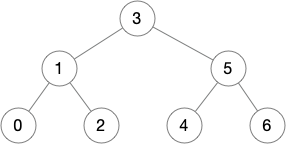

# Binary Trees with Iterators

This is the fifth blog post in a
[series](https://siek.blogspot.com/2024/06/data-structures-and-algorithms-correctly.html)
about developing correct implementations of basic data structures and
algorithms using the [Deduce](https://github.com/jsiek/deduce)
language and proof checker.

In this blog post we study binary trees, that is, trees in which each
node has at most two children. We study the in-order tree traversal,
as that will become important when we study binary search trees.
Furthermore, we develop tree iterators that keep track of a location
within the tree and can move forward with respect to the in-order
traversal.

We begin by defining a `union` for binary trees:

```{.deduce #Tree}
union Tree<E> {
  EmptyTree
  TreeNode(Tree<E>, E, Tree<E>)
}
```




<!--
``` {.deduce file=BinaryTree.pf} 
<<Tree>>

```
-->
