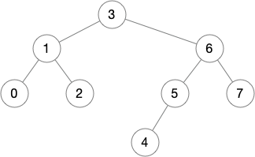

# Binary Trees with In-order Iterators

This is the fifth blog post in a
[series](https://siek.blogspot.com/2024/06/data-structures-and-algorithms-correctly.html)
about developing correct implementations of basic data structures and
algorithms using the [Deduce](https://github.com/jsiek/deduce)
language and proof checker.

In this blog post we study binary trees, that is, trees in which each
node has at most two children. We study the in-order tree traversal,
as that will become important when we study binary search trees.
Furthermore, we develop tree iterators that keep track of a location
within the tree and can move forward with respect to the in-order
traversal.

## Binary Trees

We begin by defining a `union` for binary trees:

```{.deduce #Tree}
union Tree<E> {
  EmptyTree
  TreeNode(Tree<E>, E, Tree<E>)
}
```

For example, we can represent the following binary tree 



with a bunch of tree nodes like so:

```{.deduce #BinaryTree05}
define T0 = TreeNode(EmptyTree, 0, EmptyTree)
define T2 = TreeNode(EmptyTree, 2, EmptyTree)
define T1 = TreeNode(T0, 1, T2)
define T4 = TreeNode(EmptyTree, 4, EmptyTree)
define T5 = TreeNode(T4, 5, EmptyTree)
define T7 = TreeNode(EmptyTree, 7, EmptyTree)
define T6 = TreeNode(T5, 6, T7)
define T3 = TreeNode(T1, 3, T6)
```

We define the height of a tree with the following recursive function.

```{.deduce #height}
function height<E>(Tree<E>) -> Nat {
  height(EmptyTree) = 0
  height(TreeNode(L, x, R)) = suc(max(height(L), height(R)))
}
```

The example tree has height `4`.

```{.deduce #test_height}
assert height(T3) = 4
```

We count the number of nodes in a binary tree with the `num_nodes`
function.

```{.deduce #num_nodes}
function num_nodes<E>(Tree<E>) -> Nat {
  num_nodes(EmptyTree) = 0
  num_nodes(TreeNode(L, x, R)) = suc(num_nodes(L) + num_nodes(R))
}
```

The example tree has `8` nodes.

```{.deduce #test_num_nodes}
assert num_nodes(T3) = 8
```

## In-order Tree Traversal

Now for the main event of this blog post, the in-order tree traversal.
The idea of this traversal is that for each node in the tree, we
follow this recipe:

1. process the left subtree
2. process the current node
3. process the right subtree

What it means to process a node can be different for different
instantiations of the in-order traversal. But to make things concrete,
we study an in-order traversal that produces a list. So here is our
definition of the `in_order` function.

```{.deduce #in_order}
function in_order<E>(Tree<E>) -> List<E> {
  in_order(EmptyTree) = empty
  in_order(TreeNode(L, x, R)) = append(in_order(L), node(x, in_order(R)))
}
```

The result of `in_order` for `T3` is the list `0,1,2,3,4,5,6,7`.

```{.deduce #test_in_order}
assert in_order(T3) = interval(8, 0)
```

## In-order Tree Iterators


<!--
```{.deduce file=BinaryTree.pf} 
import Nat
import List

<<Tree>>
<<height>>
<<num_nodes>>
<<in_order>>
```

```{.deduce file=BinaryTreeTest.pf} 
import Nat
import List
import BinaryTree

<<BinaryTree05>>
<<test_height>>
<<test_num_nodes>>
<<test_in_order>>
```
-->
