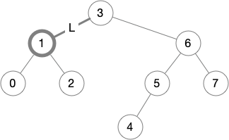

# Binary Trees with In-order Iterators (Part 2)

This is the sixth blog post in a
[series](https://siek.blogspot.com/2024/06/data-structures-and-algorithms-correctly.html)
about developing correct implementations of basic data structures and
algorithms using the [Deduce](https://github.com/jsiek/deduce)
language and proof checker. 

This post continues were we left off from the
[previous post](https://siek.blogspot.com/2024/07/binary-trees-with-in-order-iterators.html) 
in which we implemented binary trees and in-order tree iterators.

Our goal in this post is to prove that we correctly implemented the
iterator operations:

```
ti2tree : < E > fn TreeIter<E> -> Tree<E>
ti_first : < E > fn Tree<E>,E,Tree<E> -> TreeIter<E>
ti_get : < E > fn TreeIter<E> -> E
ti_next : < E > fn TreeIter<E> -> TreeIter<E>
ti_index : < E > fn(TreeIter<E>) -> Nat
```

The first operation, `ti2tree`, requires us to first obtain a tree
iterator, for example, with `ti_first`, so `ti2tree` does not have a
correctness criteria all of its own, but instead the proof of its
correctness will be part of the correctness of the other operations.

So we skip to the proof of correctness for `ti_first`.

## Correctness of `ti_first`

Let us make explicit the specification of `ti_first`:

**Specification:** The `ti_first(A, x, B)` function returns an
iterator pointing to the first node, with respect to in-order
traversal, of the tree `TreeNode(A, x, B)`.

Also, recall that we said the following about `ti2tree` and
`ti_first`: creating an iterator from a tree using `ti_first` and then
applying `ti2tree` produces the original tree.

So we have two properties to prove about `ti_first`. For the first
property, we need a way to formalize &quot;the first node with respect
to in-order traversal&quot;. This is where the `ti_index` operation
comes in. If `ti_first` returns the first node, then its index should
be `0`.  (One might worry that if `ti_index` is incorrect, then this
property would not force `ti_first` to be correct. Not to worry, we
will prove that `ti_index` is correct!)  So we have the following
theorem:

```
theorem ti_first_index: all E:type, A:Tree<E>, x:E, B:Tree<E>.
  ti_index(ti_first(A, x, B)) = 0
proof
  arbitrary E:type, A:Tree<E>, x:E, B:Tree<E>
  definition ti_first
  ?
end
```

After expanding the definition of `ti_first`, we are left with the
following goal. So we need to prove a lemma about the `first_path`
auxiliary function.

```
	ti_index(first_path(A,x,B,empty)) = 0
```

Here is a first attempt to formulate the lemma.

```
lemma first_path_index: all E:type. all A:Tree<E>. all y:E, B:Tree<E>.
  ti_index(first_path(A,y,B, empty)) = 0
```

However, because `first_path` is recursive, we will need to prove this
by recursion on `A`. But looking at the second clause of in the
definition of `first_path`, the `path` argument grows, so our
induction hypothesis, which requires the `path` argument to be empty,
will not be applicable. As is often the case, we need to generalize
the lemma. Let's replace `empty` with an arbitrary `path` as follows.

```
lemma first_path_index: all E:type. all A:Tree<E>. all y:E, B:Tree<E>, path:List<Direction<E>>.
  ti_index(first_path(A,y,B, path)) = 0
```

But now this lemma is false. Consider the following situation in which
the current node `y` is `5` and the `path` is `L,R` (going from node
`5` up to node `3`).


The index of node `5` is not `0`, it is `5`! Instead the index of node
`5` is equal to the number of nodes that come before `5` according to
in-order travesal. We can obtain that portion of the tree using
functions that we have already defined, in particular `take_path`
followed by `plug_tree`. So we can formulate the lemma as follows.

```
lemma first_path_index: all E:type. all A:Tree<E>. all y:E, B:Tree<E>, path:List<Direction<E>>.
  ti_index(first_path(A,y,B, path)) = num_nodes(plug_tree(take_path(path), EmptyTree))
proof
  arbitrary E:type
  induction Tree<E>
  case EmptyTree {
    arbitrary y:E, B:Tree<E>, path:List<Direction<E>>
    ?
  }
  case TreeNode(L, x, R) suppose IH {
    arbitrary y:E, B:Tree<E>, path:List<Direction<E>>
    ?
  }
end
```

For the case `A = EmptyTree`, the goal simply follows from the
definitions of `first_path`, `ti_index`, and `ti_take`.

```
    conclude ti_index(first_path(EmptyTree,y,B,path))
           = num_nodes(plug_tree(take_path(path),EmptyTree))
                by definition {first_path, ti_index, ti_take}.
```

For the case `A = TreeNode(L, x, R)`, after expanding the definition
of `first_path`, we need to prove:

```
  ti_index(first_path(L,x,R,node(LeftD(y,B),path)))
= num_nodes(plug_tree(take_path(path),EmptyTree))
```

But that follows from the induction hypothesis and the
definition of `take_path`.

```
    definition {first_path}
    equations
          ti_index(first_path(L,x,R,node(LeftD(y,B),path)))
        = num_nodes(plug_tree(take_path(node(LeftD(y,B),path)),EmptyTree))
                by IH[x, R, node(LeftD(y,B), path)]
    ... = num_nodes(plug_tree(take_path(path),EmptyTree))
                by definition take_path.
```

Here is the completed proof of the `first_path_index` lemma.

```{.deduce #first_path_index}
lemma first_path_index: all E:type. all A:Tree<E>. all y:E, B:Tree<E>, path:List<Direction<E>>.
  ti_index(first_path(A,y,B, path)) = num_nodes(plug_tree(take_path(path), EmptyTree))
proof
  arbitrary E:type
  induction Tree<E>
  case EmptyTree {
    arbitrary y:E, B:Tree<E>, path:List<Direction<E>>
    conclude ti_index(first_path(EmptyTree,y,B,path))
           = num_nodes(plug_tree(take_path(path),EmptyTree))
                by definition {first_path, ti_index, ti_take}.
  }
  case TreeNode(L, x, R) suppose IH {
    arbitrary y:E, B:Tree<E>, path:List<Direction<E>>
    definition {first_path}
    equations
          ti_index(first_path(L,x,R,node(LeftD(y,B),path)))
        = num_nodes(plug_tree(take_path(node(LeftD(y,B),path)),EmptyTree))
                by IH[x, R, node(LeftD(y,B), path)]
    ... = num_nodes(plug_tree(take_path(path),EmptyTree))
                by definition take_path.
  }
end
```

Returning to the proof of `ti_first_index`, we need to prove that
`ti_index(first_path(A,x,B,empty)) = 0`. So we apply the
`first_path_index` lemma and then the definitions of `take_path`,
`plug_tree`, and `num_nodes`. Here is the completed proof of
`ti_first_index`.

```{.deduce #ti_first_index}
theorem ti_first_index: all E:type, A:Tree<E>, x:E, B:Tree<E>.
  ti_index(ti_first(A, x, B)) = 0
proof
  arbitrary E:type, A:Tree<E>, x:E, B:Tree<E>
  definition ti_first
  equations  ti_index(first_path(A,x,B,empty))
           = num_nodes(plug_tree(take_path(empty),EmptyTree))
                       by first_path_index[E][A][x,B,empty]
       ... = 0      by definition {take_path, plug_tree, num_nodes}.
end
```

Our next task is to prove that creating an iterator from a tree using
`ti_first` and then applying `ti2tree` produces the original tree.

```
theorem ti_first_stable: all E:type, A:Tree<E>, x:E, B:Tree<E>.
  ti2tree(ti_first(A, x, B)) = TreeNode(A, x, B)
proof
  arbitrary E:type, A:Tree<E>, x:E, B:Tree<E>
  definition ti_first
  ?
end
```

After expanding the definition of `ti_first`, we are left to prove
that

```
ti2tree(first_path(A,x,B,empty)) = TreeNode(A,x,B)
```

So we need to prove another lemma about `first_path` and again we need
to generalize the `empty` path to an arbitrary path. Let us consider
again the situation where the current node `x` is `5`.


The result of `first_path(A,x,B,path)` will be the path to node `4`,
and the result of `ti2tree` will be the whole tree, not just `TreeNode(A,x,B)`
as in the above equation. However, we can construct the whole tree
from the `path` and `TreeNode(A,x,B)` using the `plug_tree` function.
So we have the following lemma to prove.

```
lemma first_path_stable:
  all E:type. all A:Tree<E>. all y:E, B:Tree<E>, path:List<Direction<E>>.
  ti2tree(first_path(A, y, B, path)) = plug_tree(path, TreeNode(A, y, B))
proof
  arbitrary E:type
  induction Tree<E>
  case EmptyTree {
    arbitrary y:E, B:Tree<E>, path:List<Direction<E>>
    ?
  }
  case TreeNode(L, x, R) suppose IH_L, IH_R {
    arbitrary y:E, B:Tree<E>, path:List<Direction<E>>
    ?
  }
end
```

In the case `A = EmptyTree`, we prove the equation using the
definitions of `first_path` and `ti2tree`.

```
    equations  ti2tree(first_path(EmptyTree,y,B,path))
             = ti2tree(TrItr(path,EmptyTree,y,B))       by definition first_path.
         ... = plug_tree(path,TreeNode(EmptyTree,y,B))  by definition ti2tree.
```

In the case `A = TreeNode(L, x, R)`, we need to prove that
```
  ti2tree(first_path(TreeNode(L,x,R),y,B,path))
= plug_tree(path,TreeNode(TreeNode(L,x,R),y,B))
```

We probably need to expand the definition of `first_path`, but doing
so in your head is hard. So we can instead ask Deduce to do it.  We
start by constructing an equation with a bogus right-hand side
and apply the definition of `first_path`.

```
    equations
          ti2tree(first_path(TreeNode(L,x,R),y,B,path))
        = EmptyTree
             by definition first_path ?
    ... = plug_tree(path,TreeNode(TreeNode(L,x,R),y,B))
             by ?
```

Deduce responds with

```
incomplete proof
Goal:
	ti2tree(first_path(L,x,R,node(LeftD(y,B),path))) = EmptyTree
```

in which the left-hand side has expanded the definition of
`first_path`. So we cut and paste that into our proof and move on to
the next step.

```
    equations
          ti2tree(first_path(TreeNode(L,x,R),y,B,path))
        = ti2tree(first_path(L,x,R,node(LeftD(y,B),path)))
             by definition first_path.
    ... = plug_tree(path,TreeNode(TreeNode(L,x,R),y,B))
             by ?
```

We now have something that matches the induction hypothesis, so we
instantiate it and ask Deduce to tell us the new right-hand side.

```
    equations
          ti2tree(first_path(TreeNode(L,x,R),y,B,path))
        = ti2tree(first_path(L,x,R,node(LeftD(y,B),path)))
             by definition first_path.
    ... = EmptyTree
             by IH_L[x,R,node(LeftD(y,B),path)]
    ... = plug_tree(path,TreeNode(TreeNode(L,x,R),y,B))
             by ?
```

Deduce responds with

```
expected
ti2tree(first_path(L,x,R,node(LeftD(y,B),path))) = EmptyTree
but only have
ti2tree(first_path(L,x,R,node(LeftD(y,B),path))) = plug_tree(node(LeftD(y,B),path),TreeNode(L,x,R))
```

So we cut and paste the right-hand side of the induction hypothesis
to replace `EmptyTree`.

```
    equations
          ti2tree(first_path(TreeNode(L,x,R),y,B,path))
        = ti2tree(first_path(L,x,R,node(LeftD(y,B),path)))
             by definition first_path.
    ... = plug_tree(node(LeftD(y,B),path),TreeNode(L,x,R))
             by IH_L[x,R,node(LeftD(y,B),path)]
    ... = plug_tree(path,TreeNode(TreeNode(L,x,R),y,B))
             by ?
```

The final step of the proof is easy; we just apply the definition of `plug_tree`.
Here is the completed proof of `first_path_stable`.

```{.deduce #first_path_stable}
lemma first_path_stable:
  all E:type. all A:Tree<E>. all y:E, B:Tree<E>, path:List<Direction<E>>.
  ti2tree(first_path(A, y, B, path)) = plug_tree(path, TreeNode(A, y, B))
proof
  arbitrary E:type
  induction Tree<E>
  case EmptyTree {
    arbitrary y:E, B:Tree<E>, path:List<Direction<E>>
    equations  ti2tree(first_path(EmptyTree,y,B,path))
             = ti2tree(TrItr(path,EmptyTree,y,B))       by definition first_path.
         ... = plug_tree(path,TreeNode(EmptyTree,y,B))  by definition ti2tree.
  }
  case TreeNode(L, x, R) suppose IH_L, IH_R {
    arbitrary y:E, B:Tree<E>, path:List<Direction<E>>
    equations
          ti2tree(first_path(TreeNode(L,x,R),y,B,path))
        = ti2tree(first_path(L,x,R,node(LeftD(y,B),path)))
             by definition first_path.
    ... = plug_tree(node(LeftD(y,B),path),TreeNode(L,x,R))
             by IH_L[x,R,node(LeftD(y,B),path)]
    ... = plug_tree(path,TreeNode(TreeNode(L,x,R),y,B))
             by definition plug_tree.
  }
end
```

Returning to the `ti_first_stable` theorem, the equation follows from
our `first_path_stable` lemma and the definition of `plug_tree`.


```{.deduce #ti_first_stable}
theorem ti_first_stable: all E:type, A:Tree<E>, x:E, B:Tree<E>.
  ti2tree(ti_first(A, x, B)) = TreeNode(A, x, B)
proof
  arbitrary E:type, A:Tree<E>, x:E, B:Tree<E>
  definition ti_first
  equations  ti2tree(first_path(A,x,B,empty))
           = plug_tree(empty,TreeNode(A,x,B))  by first_path_stable[E][A][x,B,empty]
       ... = TreeNode(A,x,B)                   by definition plug_tree.
end
```

## Correctness of `ti_next`

We start by writing down a more careful specification of `ti_next`.

**Specification:** The `ti_next(iter)` operation returns an iterator
whose position is one more than the position of `iter` with respect to
in-order traversal, assuming the `iter` is not at the end of the
in-order traversal.

To make this specification formal, we can again use `ti_index` to talk
about the position of the iterator. So we begin to prove the following
theorem `ti_next_index`, taking the usual initial steps in the proof
as guided by the formula to be proved and the definition of `ti_next`,
which performs a `switch` on the right child `R` of the current node.

```
theorem ti_next_index: all E:type, iter : TreeIter<E>.
  if suc(ti_index(iter)) < num_nodes(ti2tree(iter))
  then ti_index(ti_next(iter)) = suc(ti_index(iter))
proof
  arbitrary E:type, iter : TreeIter<E>
  suppose prem: suc(ti_index(iter)) < num_nodes(ti2tree(iter))
  switch iter {
    case TrItr(path, L, x, R) suppose iter_eq {
      definition ti_next
      switch R {
        case EmptyTree suppose R_eq {
          ?
        }
        case TreeNode(RL, y, RR) suppose R_eq {
          ?
        }
      }
    }
  }
end
```

In the case `R = EmptyTree`, `ti_next` calls the auxiliary function
`next_up` and we need to prove.

```
ti_index(next_up(path,L,x,EmptyTree)) = suc(ti_index(TrItr(path,L,x,EmptyTree)))
```

As usual, we must create a lemma that generalizes this equation.

## Proving the `next_up_index` lemma

Looking at the definition of `next_up`, we see that the recursive call
grows the fourth argument, so we must replace the `EmptyTree` in the
needed equation with an arbitrary tree `R`:

```
ti_index(next_up(path,L,x,R)) = suc(ti_index(TrItr(path,L,x,R)))
```

But this equation is not true in general. Consider the situation below
where the current node `x` is node `1` in our example tree. The index
of the `next_up` from node `1` is `3`, but the index of node `1` is
`1` and of course, adding one to that is `2`, not `3`!



So we need to change this equation to account for the situation where
`R` is not empty, but instead an arbitrary subtree. The solution is to
add the number of nodes in `R` to the right-hand side:

```
ti_index(next_up(path,L,x,R)) = suc(ti_index(TrItr(path,L,x,R))) + num_nodes(R)
```

One more addition is necessary to formulate the lemma.  The above
equation is only meaningful when the index on the right-hand side is
in bounds. That is, it must be smaller than the number of nodes in the
tree. So we formula the lemma `next_up_index` as follows and take a
few obvious steps into the proof.

```
lemma next_up_index: all E:type. all path:List<Direction<E>>. all A:Tree<E>, x:E, B:Tree<E>.
  if suc(ti_index(TrItr(path, A, x, B)) + num_nodes(B)) < num_nodes(ti2tree(TrItr(path, A, x, B)))
  then ti_index(next_up(path, A, x, B)) = suc(ti_index(TrItr(path, A,x,B)) + num_nodes(B))
proof
  arbitrary E:type
  induction List<Direction<E>>
  case empty {
    arbitrary A:Tree<E>, x:E, B:Tree<E>
    suppose prem: suc(ti_index(TrItr(empty,A,x,B)) + num_nodes(B)) 
                  < num_nodes(ti2tree(TrItr(empty,A,x,B)))
    ?
  }
  case node(f, path') suppose IH {
    arbitrary A:Tree<E>, x:E, B:Tree<E>
    suppose prem
    switch f {
      case LeftD(y, R) {
        ?
      }
      case RightD(L, y) suppose f_eq {
        ?
      }
    }
  }
end
```

In the case `path = empty`, the premise is false because there are no
nodes that come afterwards in the in-order traversal. In particular,
the premise implies the following contradictory inequality.

```
    have AB_l_AB: suc(num_nodes(A) + num_nodes(B)) < suc(num_nodes(A) + num_nodes(B))
      by definition {ti_index, ti_take, take_path, plug_tree, ti2tree, num_nodes} 
         in prem
    conclude false  by apply less_irreflexive to AB_l_AB
```

Next consider the case `path = node(LeftD(y, R), path')`.
After expanding all the relevant definitions, we need to
prove that

```
  num_nodes(plug_tree(take_path(path'), TreeNode(A,x,B))) 
= suc(num_nodes(plug_tree(take_path(path'), A)) + num_nodes(B))
```

We need a lemma that relates `num_nodes` and `plug_tree`. 
So we pause the current proof for the following exercise.


## Exercise: prove the `num_nodes_plug` lemma

```
lemma num_nodes_plug: all E:type. all path:List<Direction<E>>. all t:Tree<E>.
  num_nodes(plug_tree(path, t)) = num_nodes(plug_tree(path, EmptyTree)) + num_nodes(t)
```

## Back to the `next_up_index` lemma

We use `num_nodes_plug` on both the left and right-hand sides of the equation,
and apply the definition of `num_nodes`.

```
    rewrite num_nodes_plug[E][take_path(path')][TreeNode(A,x,B)]
    rewrite num_nodes_plug[E][take_path(path')][A]
    definition num_nodes
```

After that it suffices to prove the following.

```
  num_nodes(plug_tree(take_path(path'),EmptyTree)) + suc(num_nodes(A) + num_nodes(B)) 
= suc((num_nodes(plug_tree(take_path(path'),EmptyTree)) + num_nodes(A)) + num_nodes(B))
```

This equation is rather big, so let's squint at it by giving names to its parts.
(This is a new version of `define` that I'm experimenting with.)

```
    define_ X = num_nodes(plug_tree(take_path(path'),EmptyTree))
    define_ Y = num_nodes(A)
    define_ Z = num_nodes(B)
```

Now it's easy to see that our goal is true using some simple
arithmetic.

```
    conclude X + suc(Y + Z) = suc((X + Y) + Z)
        by rewrite add_suc[X][Y+Z] | add_assoc[X][Y,Z].
```

Finally, consider the case `path = node(RightD(L, y), path')`. 
After expanding the definition of `next_up`, we need to prove

```
  ti_index(next_up(path',L,y,TreeNode(A,x,B))) 
= suc(ti_index(TrItr(node(RightD(L,y),path'),A,x,B)) + num_nodes(B))
```

The left-hand side matches the induction hypothesis, so we have

```
    equations
      ti_index(next_up(path',L,y,TreeNode(A,x,B))) 
        = suc(ti_index(TrItr(path',L,y,TreeNode(A,x,B))) + num_nodes(TreeNode(A,x,B)))
            by apply IH[L,y,TreeNode(A,x,B)] 
               to definition {ti_index, ti_take, num_nodes, ti2tree} ?
    ... = suc(ti_index(TrItr(node(RightD(L,y),path'),A,x,B)) + num_nodes(B))
            by ?
```

But we need to prove the premise of the induction hypothesis.  We can
do that as follows, which many uses of `num_nodes_plug` and some
arithmetic that we package up into lemma `XYZW_equal`.

```
    have IH_prem: suc(num_nodes(plug_tree(take_path(path'),L)) 
                      + suc(num_nodes(A) + num_nodes(B))) 
                  < num_nodes(plug_tree(path',TreeNode(L,y,TreeNode(A,x,B))))
      by rewrite num_nodes_plug[E][take_path(path')][L]
          | num_nodes_plug[E][path'][TreeNode(L,y,TreeNode(A,x,B))]
         definition {num_nodes, num_nodes}
         define_ X = num_nodes(plug_tree(take_path(path'),EmptyTree))
         define_ Y = num_nodes(L) define_ Z = num_nodes(A) define_ W = num_nodes(B)
         define_ P = num_nodes(plug_tree(path',EmptyTree))
         suffices suc((X + Y) + suc(Z + W)) < P + suc(Y + suc(Z + W))
         have prem2: suc((X + suc(Y + Z)) + W) < P + suc(Y + suc(Z + W))
           by enable {X,Y,Z,W,P}
              definition {num_nodes, num_nodes} in
              rewrite num_nodes_plug[E][take_path(path')][TreeNode(L,y,A)]
                    | num_nodes_plug[E][path'][TreeNode(L,y,TreeNode(A,x,B))] in
              definition {ti_index, ti_take, take_path, ti2tree, plug_tree} in
              rewrite f_eq in prem
         rewrite XYZW_equal[X,Y,Z,W]
         prem2
```

Here is the proof of `XYZW_equal`.

```{.deduce #XYZW_equal}
lemma XYZW_equal: all X:Nat, Y:Nat, Z:Nat, W:Nat.
  suc((X + Y) + suc(Z + W)) = suc((X + suc(Y + Z)) + W)
proof
  arbitrary X:Nat, Y:Nat, Z:Nat, W:Nat
  enable {operator+}
  equations
        suc((X + Y) + suc(Z + W))
      = suc(suc(X + Y) + (Z + W))      by rewrite add_suc[X+Y][Z+W].
  ... = suc(suc(((X + Y) + Z) + W))    by rewrite add_assoc[X+Y][Z,W].
  ... = suc(suc((X + (Y + Z)) + W))    by rewrite add_assoc[X][Y,Z].
  ... = suc((X + suc(Y + Z)) + W)      by rewrite add_suc[X][Y+Z].
end
```

Getting back to the equational proof, it remains to prove that

```
  suc(ti_index(TrItr(path',L,y,TreeNode(A,x,B))) + num_nodes(TreeNode(A,x,B)))
= suc(ti_index(TrItr(node(RightD(L,y),path'),A,x,B)) + num_nodes(B))
```

which we can do with yet more uses of `num_nodes_plug` and `XYZW_equal`.

```
    ... = suc(num_nodes(plug_tree(take_path(path'),L)) + suc(num_nodes(A) + num_nodes(B)))
          by definition {ti_index, ti_take, num_nodes}.
    ... = suc((num_nodes(plug_tree(take_path(path'),EmptyTree)) + num_nodes(L))
              + suc(num_nodes(A) + num_nodes(B)))
          by rewrite num_nodes_plug[E][take_path(path')][L].
    ... = suc((num_nodes(plug_tree(take_path(path'),EmptyTree)) 
              + suc(num_nodes(L) + num_nodes(A))) + num_nodes(B))
          by define_ X = num_nodes(plug_tree(take_path(path'),EmptyTree))
             define_ Y = num_nodes(L) define_ Z = num_nodes(A) define_ W = num_nodes(B)
             define_ P = num_nodes(plug_tree(path',EmptyTree))
             conclude suc((X + Y) + suc(Z + W)) = suc((X + suc(Y + Z)) + W)
                 by XYZW_equal[X,Y,Z,W]
    ... = suc(num_nodes(plug_tree(take_path(path'),TreeNode(L,y,A))) + num_nodes(B))
          by rewrite num_nodes_plug[E][take_path(path')][TreeNode(L,y,A)]
             definition {num_nodes, num_nodes}.
    ... = suc(ti_index(TrItr(node(RightD(L,y),path'),A,x,B)) + num_nodes(B))
          by definition {ti_index, ti_take, take_path, plug_tree}.
```

That completes the last case of the proof of `next_up_index`.
Here's the completed proof.

```{.deduce #next_up_index}
lemma next_up_index: all E:type. all path:List<Direction<E>>. all A:Tree<E>, x:E, B:Tree<E>.
  if suc(ti_index(TrItr(path, A, x, B)) + num_nodes(B)) < num_nodes(ti2tree(TrItr(path, A, x, B)))
  then ti_index(next_up(path, A, x, B)) = suc(ti_index(TrItr(path, A,x,B)) + num_nodes(B))
proof
  arbitrary E:type
  induction List<Direction<E>>
  case empty {
    arbitrary A:Tree<E>, x:E, B:Tree<E>
    suppose prem: suc(ti_index(TrItr(empty,A,x,B)) + num_nodes(B)) 
                  < num_nodes(ti2tree(TrItr(empty,A,x,B)))
    have AB_l_AB: suc(num_nodes(A) + num_nodes(B)) < suc(num_nodes(A) + num_nodes(B))
      by definition {ti_index, ti_take, take_path, plug_tree, ti2tree, num_nodes} 
         in prem
    conclude false  by apply less_irreflexive to AB_l_AB
  }
  case node(f, path') suppose IH {
    arbitrary A:Tree<E>, x:E, B:Tree<E>
    suppose prem
    switch f {
      case LeftD(y, R) {
        definition {next_up, ti_index, ti_take, take_path}
        rewrite num_nodes_plug[E][take_path(path')][TreeNode(A,x,B)]
        rewrite num_nodes_plug[E][take_path(path')][A]
        definition num_nodes
        define_ X = num_nodes(plug_tree(take_path(path'),EmptyTree))
        define_ Y = num_nodes(A)
        define_ Z = num_nodes(B)
        conclude X + suc(Y + Z) = suc((X + Y) + Z)
            by rewrite add_suc[X][Y+Z] | add_assoc[X][Y,Z].
      }
      case RightD(L, y) suppose f_eq {
        definition {next_up}
        have IH_prem: suc(num_nodes(plug_tree(take_path(path'),L)) 
                          + suc(num_nodes(A) + num_nodes(B))) 
                      < num_nodes(plug_tree(path',TreeNode(L,y,TreeNode(A,x,B))))
          by rewrite num_nodes_plug[E][take_path(path')][L]
              | num_nodes_plug[E][path'][TreeNode(L,y,TreeNode(A,x,B))]
             definition {num_nodes, num_nodes}
             define_ X = num_nodes(plug_tree(take_path(path'),EmptyTree))
             define_ Y = num_nodes(L) define_ Z = num_nodes(A) define_ W = num_nodes(B)
             define_ P = num_nodes(plug_tree(path',EmptyTree))
             suffices suc((X + Y) + suc(Z + W)) < P + suc(Y + suc(Z + W))
             have prem2: suc((X + suc(Y + Z)) + W) < P + suc(Y + suc(Z + W))
               by enable {X,Y,Z,W,P}
                  definition {num_nodes, num_nodes} in
                  rewrite num_nodes_plug[E][take_path(path')][TreeNode(L,y,A)]
                        | num_nodes_plug[E][path'][TreeNode(L,y,TreeNode(A,x,B))] in
                  definition {ti_index, ti_take, take_path, ti2tree, plug_tree} in
                  rewrite f_eq in prem
             rewrite XYZW_equal[X,Y,Z,W]
             prem2
        equations
              ti_index(next_up(path',L,y,TreeNode(A,x,B))) 
            = suc(ti_index(TrItr(path',L,y,TreeNode(A,x,B))) + num_nodes(TreeNode(A,x,B)))
                by apply IH[L,y,TreeNode(A,x,B)] 
                   to definition {ti_index, ti_take, num_nodes, ti2tree} IH_prem
        ... = suc(num_nodes(plug_tree(take_path(path'),L)) + suc(num_nodes(A) + num_nodes(B)))
              by definition {ti_index, ti_take, num_nodes}.
        ... = suc((num_nodes(plug_tree(take_path(path'),EmptyTree)) + num_nodes(L))
                  + suc(num_nodes(A) + num_nodes(B)))
              by rewrite num_nodes_plug[E][take_path(path')][L].
        ... = suc((num_nodes(plug_tree(take_path(path'),EmptyTree)) 
                  + suc(num_nodes(L) + num_nodes(A))) + num_nodes(B))
              by define_ X = num_nodes(plug_tree(take_path(path'),EmptyTree))
                 define_ Y = num_nodes(L) define_ Z = num_nodes(A) define_ W = num_nodes(B)
                 define_ P = num_nodes(plug_tree(path',EmptyTree))
                 conclude suc((X + Y) + suc(Z + W)) = suc((X + suc(Y + Z)) + W)
                     by XYZW_equal[X,Y,Z,W]
        ... = suc(num_nodes(plug_tree(take_path(path'),TreeNode(L,y,A))) + num_nodes(B))
              by rewrite num_nodes_plug[E][take_path(path')][TreeNode(L,y,A)]
                 definition {num_nodes, num_nodes}.
        ... = suc(ti_index(TrItr(node(RightD(L,y),path'),A,x,B)) + num_nodes(B))
              by definition {ti_index, ti_take, take_path, plug_tree}.
      }
    }
  }
end
```

## Back to the proof of `ti_next_index`

With the `next_up_index` lemma complete, we can get back to proving
the `ti_next_index` theorem. Recall that we were in the case
`R = EmptyTree` and needed to prove the following.

```
ti_index(next_up(path,L,x,EmptyTree)) = suc(ti_index(TrItr(path,L,x,EmptyTree)))
```

To use the `next_up_index` lemma, we need to prove its premise:

```
    have next_up_index_prem:
        suc(ti_index(TrItr(path,L,x,EmptyTree)) + num_nodes(EmptyTree))
        < num_nodes(ti2tree(TrItr(path,L,x,EmptyTree)))
      by enable num_nodes
         rewrite add_zero[ti_index(TrItr(path,L,x,EmptyTree))]
         rewrite iter_eq | R_eq in prem
```

We can finish the proof of the equation using the definition of
`num_nodes` and the `add_zero` property.

```
    equations
          ti_index(next_up(path,L,x,EmptyTree))
        = suc(ti_index(TrItr(path,L,x,EmptyTree)) + num_nodes(EmptyTree))
          by apply next_up_index[E][path][L, x, EmptyTree] to next_up_index_prem
    ... = suc(ti_index(TrItr(path,L,x,EmptyTree)))
          by definition num_nodes
             rewrite add_zero[ti_index(TrItr(path,L,x,EmptyTree))].
```

The next case in the proof of `ti_next_index` is for `R = TreeNode(RL, y, RR)`.
We need to prove 

```
  ti_index(first_path(RL,y,RR,node(RightD(L,x),path))) 
= suc(ti_index(TrItr(path,L,x,TreeNode(RL,y,RR))))
```

We can start by applying the `first_path_index` lemma, which
gives us

```
      ti_index(first_path(RL,y,RR,node(RightD(L,x),path))) 
    = num_nodes(plug_tree(take_path(node(RightD(L,x),path)),EmptyTree))
```

We have opportunities to expand `take_path` and then `plug_tree`.

```
... = num_nodes(plug_tree(take_path(path),TreeNode(L,x,EmptyTree)))
        by definition {take_path,plug_tree}.
```

We can separate out the `TreeNode(L,x,EmptyTree)` using
`num_nodes_plug`.

```
... = num_nodes(plug_tree(take_path(path),EmptyTree)) + suc(num_nodes(L))
        by rewrite num_nodes_plug[E][take_path(path)][TreeNode(L,x,EmptyTree)]
           definition {num_nodes, num_nodes}
           rewrite add_zero[num_nodes(L)].
```

Then we can move the `L` back into the `plug_tree` with
`num_nodes_plug`.

```
... = suc(num_nodes(plug_tree(take_path(path),L)))
       by rewrite add_suc[num_nodes(plug_tree(take_path(path),EmptyTree))][num_nodes(L)]
          rewrite num_nodes_plug[E][take_path(path)][L].
```

We conclude the equational reasoning with the definition of `ti_index` and `ti_take`.

```
... = suc(ti_index(TrItr(path,L,x,TreeNode(RL,y,RR))))
        by definition {ti_index, ti_take}.
```

Here is the complete proof of `ti_next_index`.

```{.deduce #ti_next_index}
theorem ti_next_index: all E:type, iter : TreeIter<E>.
  if suc(ti_index(iter)) < num_nodes(ti2tree(iter))
  then ti_index(ti_next(iter)) = suc(ti_index(iter))
proof
  arbitrary E:type, iter : TreeIter<E>
  suppose prem: suc(ti_index(iter)) < num_nodes(ti2tree(iter))
  switch iter {
    case TrItr(path, L, x, R) suppose iter_eq {
      definition ti_next
      switch R {
        case EmptyTree suppose R_eq {
          have next_up_index_prem:
              suc(ti_index(TrItr(path,L,x,EmptyTree)) + num_nodes(EmptyTree))
              < num_nodes(ti2tree(TrItr(path,L,x,EmptyTree)))
            by enable num_nodes
               rewrite add_zero[ti_index(TrItr(path,L,x,EmptyTree))]
               rewrite iter_eq | R_eq in prem
          equations
                ti_index(next_up(path,L,x,EmptyTree))
              = suc(ti_index(TrItr(path,L,x,EmptyTree)) + num_nodes(EmptyTree))
                by apply next_up_index[E][path][L, x, EmptyTree] to next_up_index_prem
          ... = suc(ti_index(TrItr(path,L,x,EmptyTree)))
                by definition num_nodes
                   rewrite add_zero[ti_index(TrItr(path,L,x,EmptyTree))].
        }
        case TreeNode(RL, y, RR) suppose R_eq {
          equations
                ti_index(first_path(RL,y,RR,node(RightD(L,x),path))) 
              = num_nodes(plug_tree(take_path(node(RightD(L,x),path)),EmptyTree))
                  by first_path_index[E][RL][y,RR,node(RightD(L,x),path)]
          ... = num_nodes(plug_tree(take_path(path),TreeNode(L,x,EmptyTree)))
                  by definition {take_path,plug_tree}.
          ... = num_nodes(plug_tree(take_path(path),EmptyTree)) + suc(num_nodes(L))
                  by rewrite num_nodes_plug[E][take_path(path)][TreeNode(L,x,EmptyTree)]
                     definition {num_nodes, num_nodes}
                     rewrite add_zero[num_nodes(L)].
          ... = suc(num_nodes(plug_tree(take_path(path),L)))
                 by rewrite add_suc[num_nodes(plug_tree(take_path(path),EmptyTree))][num_nodes(L)]
                    rewrite num_nodes_plug[E][take_path(path)][L].
          ... = suc(ti_index(TrItr(path,L,x,TreeNode(RL,y,RR))))
                  by definition {ti_index, ti_take}.

        }
      }
   }
  }
end
```

## Correctness of `ti_get` and `ti_index`


<!--
```{.deduce file=BinaryTreeProof.pf} 
import BinaryTree

<<first_path_index>>
<<ti_first_index>>

<<first_path_stable>>
<<ti_first_stable>>

lemma num_nodes_plug: all E:type. all path:List<Direction<E>>. all t:Tree<E>.
  num_nodes(plug_tree(path, t)) = num_nodes(plug_tree(path, EmptyTree)) + num_nodes(t)
proof  
  arbitrary E:type
  induction List<Direction<E>>
  case empty {
    arbitrary t:Tree<E>
    conclude num_nodes(plug_tree(empty,t)) = num_nodes(plug_tree(empty,EmptyTree)) + num_nodes(t)
        by definition {plug_tree, num_nodes, operator+}.
  }
  case node(f, path') suppose IH {
    arbitrary t:Tree<E>
    switch f {
      case LeftD(x, R) {
        definition {plug_tree, num_nodes}
        rewrite IH[TreeNode(t,x,R)]
        rewrite IH[TreeNode(EmptyTree,x,R)]
        definition {num_nodes, num_nodes, operator+}
        rewrite add_assoc[num_nodes(plug_tree(path',EmptyTree))][suc(num_nodes(R)), num_nodes(t)]
        definition {operator+}
        rewrite add_commute[num_nodes(R)][num_nodes(t)].
      }
      case RightD(L, x) {
        definition {plug_tree, num_nodes}
        rewrite IH[TreeNode(L,x,t)]
        rewrite IH[TreeNode(L,x,EmptyTree)]
        definition {num_nodes, num_nodes}
        rewrite add_zero[num_nodes(L)]
        rewrite add_assoc[num_nodes(plug_tree(path',EmptyTree))][suc(num_nodes(L)), num_nodes(t)]
        definition {operator+}.
      }
    }
  }
end

<<XYZW_equal>>
<<next_up_index>>
<<ti_next_index>>
```
-->
