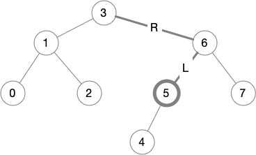

# Binary Trees with In-order Iterators (Part 2)

This is the sixth blog post in a
[series](https://siek.blogspot.com/2024/06/data-structures-and-algorithms-correctly.html)
about developing correct implementations of basic data structures and
algorithms using the [Deduce](https://github.com/jsiek/deduce)
language and proof checker. 

This post continues were we left off from the
[previous post](https://siek.blogspot.com/2024/07/binary-trees-with-in-order-iterators.html) 
in which we implemented binary trees and in-order tree iterators.

Our goal in this post is to prove that we correctly implemented the
iterator operations:

```
ti2tree : < E > fn TreeIter<E> -> Tree<E>
ti_first : < E > fn Tree<E>,E,Tree<E> -> TreeIter<E>
ti_get : < E > fn TreeIter<E> -> E
ti_next : < E > fn TreeIter<E> -> TreeIter<E>
ti_index : < E > fn(TreeIter<E>) -> Nat
```

The first operation, `ti2tree`, requires us to first obtain a tree
iterator, for example, with `ti_first`, so `ti2tree` does not have a
correctness criteria all of its own, but instead the proof of its
correctness will be part of the correctness of the other operations.

So we skip to the proof of correctness for `ti_first`.

## Correctness of `ti_first`

Let us recall and make explicit the specification of `ti_first`:

**Specification:** The `ti_first(A, x, B)` function returns an
iterator pointing to the first node with respect to in-order
traversal, of the tree `TreeNode(A, x, B)`.

Also, recall that we said the following about `ti2tree` and
`ti_first`: creating an iterator from a tree using `ti_first` and then
applying `ti2tree` produces the original tree.

So we have two properties to prove about `ti_first`. For the first
property, we need a way to formalize &quot;the first node with respect
to in-order traversal&quot;. This is where the `ti_index` operation
comes in. If `ti_first` returns the first node, then its index should
be `0`.  (One might worry that if `ti_index` is incorrect, then this
property would not force `ti_first` to be correct. Not to worry, we
will prove that `ti_index` is correct!)  So we have the following
theorem:

```
theorem ti_first_index: all E:type, A:Tree<E>, x:E, B:Tree<E>.
  ti_index(ti_first(A, x, B)) = 0
proof
  arbitrary E:type, A:Tree<E>, x:E, B:Tree<E>
  definition ti_first
  ?
end
```

After expanding the definition of `ti_first`, we are left with the
following goal. So we need to prove a lemma about the `first_path`
auxiliary function.

```
	ti_index(first_path(A,x,B,empty)) = 0
```

Here is a first attempt to formulate the lemma.

```
lemma first_path_index: all E:type. all A:Tree<E>. all y:E, B:Tree<E>.
  ti_index(first_path(A,y,B, empty)) = 0
```

However, because `first_path` is recursive, we will need to prove this
by recursion on `A`. But looking at the second clause of in the
definition of `first_path`, the `path` argument grows, so our
induction hypothesis, which requires the `path` argument to be empty,
will not be applicable. As is often the case, we need to generalize
the lemma. Let's replace `empty` with an arbitrary `path` as follows.

```
lemma first_path_index: all E:type. all A:Tree<E>. all y:E, B:Tree<E>, path:List<Direction<E>>.
  ti_index(first_path(A,y,B, path)) = 0
```

But now this lemma is false. Consider the following situation in which
the current node `y` is `5` and the `path` is `L,R` (going from node
`5` up to node `3`).



The index of node `5` is not `0`, it is `5`! Instead the index of node
`5` is equal to the number of nodes that come before `5` according to
in-order travesal. We can obtain that portion of the tree using
functions that we have already defined, in particular `take_path`
followed by `plug_tree`. So we can formulate the lemma as follows.

```
lemma first_path_index: all E:type. all A:Tree<E>. all y:E, B:Tree<E>, path:List<Direction<E>>.
  ti_index(first_path(A,y,B, path)) = num_nodes(plug_tree(take_path(path), EmptyTree))
proof
  arbitrary E:type
  induction Tree<E>
  case EmptyTree {
    arbitrary y:E, B:Tree<E>, path:List<Direction<E>>
    ?
  }
  case TreeNode(L, x, R) suppose IH {
    arbitrary y:E, B:Tree<E>, path:List<Direction<E>>
    ?
  }
end
```

For the case `A = EmptyTree`, the goal simply follows from the
definitions of `first_path`, `ti_index`, and `ti_take`.

```
    conclude ti_index(first_path(EmptyTree,y,B,path))
           = num_nodes(plug_tree(take_path(path),EmptyTree))
                by definition {first_path, ti_index, ti_take}.
```

For the case `A = TreeNode(L, x, R)`, after expanding the definition
of `first_path`, we need to prove:

```
  ti_index(first_path(L,x,R,node(LeftD(y,B),path)))
= num_nodes(plug_tree(take_path(path),EmptyTree))
```

But that follows from the induction hypothesis and the
definition of `take_path`.

```
    definition {first_path}
    equations
          ti_index(first_path(L,x,R,node(LeftD(y,B),path)))
        = num_nodes(plug_tree(take_path(node(LeftD(y,B),path)),EmptyTree))
                by IH[x, R, node(LeftD(y,B), path)]
    ... = num_nodes(plug_tree(take_path(path),EmptyTree))
                by definition take_path.
```

Here is the completed proof of the `first_path_index` lemma.

```{.deduce #first_path_index}
lemma first_path_index: all E:type. all A:Tree<E>. all y:E, B:Tree<E>, path:List<Direction<E>>.
  ti_index(first_path(A,y,B, path)) = num_nodes(plug_tree(take_path(path), EmptyTree))
proof
  arbitrary E:type
  induction Tree<E>
  case EmptyTree {
    arbitrary y:E, B:Tree<E>, path:List<Direction<E>>
    conclude ti_index(first_path(EmptyTree,y,B,path))
           = num_nodes(plug_tree(take_path(path),EmptyTree))
                by definition {first_path, ti_index, ti_take}.
  }
  case TreeNode(L, x, R) suppose IH {
    arbitrary y:E, B:Tree<E>, path:List<Direction<E>>
    definition {first_path}
    equations
          ti_index(first_path(L,x,R,node(LeftD(y,B),path)))
        = num_nodes(plug_tree(take_path(node(LeftD(y,B),path)),EmptyTree))
                by IH[x, R, node(LeftD(y,B), path)]
    ... = num_nodes(plug_tree(take_path(path),EmptyTree))
                by definition take_path.
  }
end
```

Returning to the proof of `ti_first_index`, we need to prove that
`ti_index(first_path(A,x,B,empty)) = 0`. So we apply the
`first_path_index` lemma and then the definitions of `take_path`,
`plug_tree`, and `num_nodes`. Here is the completed proof of
`ti_first_index`.

```{.deduce #ti_first_index}
theorem ti_first_index: all E:type, A:Tree<E>, x:E, B:Tree<E>.
  ti_index(ti_first(A, x, B)) = 0
proof
  arbitrary E:type, A:Tree<E>, x:E, B:Tree<E>
  definition ti_first
  equations  ti_index(first_path(A,x,B,empty))
           = num_nodes(plug_tree(take_path(empty),EmptyTree))
                       by first_path_index[E][A][x,B,empty]
       ... = 0      by definition {take_path, plug_tree, num_nodes}.
end
```

Our next task is to prove that creating an iterator from a tree using
`ti_first` and then applying `ti2tree` produces the original tree.

```
theorem ti_first_stable: all E:type, A:Tree<E>, x:E, B:Tree<E>.
  ti2tree(ti_first(A, x, B)) = TreeNode(A, x, B)
proof
  arbitrary E:type, A:Tree<E>, x:E, B:Tree<E>
  definition {ti_first, ti2tree}
  ?
end
```

After expanding the definitions of `ti_first` and `ti2tree`, we are
left to prove that

```
ti2tree(first_path(A,x,B,empty)) = TreeNode(A,x,B)
```

So we need to prove another lemma about `first_path` and again we need
to generalize the `empty` path to an arbitrary path. Let us consider
again the situation where the current node `x` is `5`.


The result of `first_path(A,x,B,path)` will be the path to node `4`,
and the result of `ti2tree` will be the whole tree, not just `TreeNode(A,x,B)`
as in the above equation. However, we can construct the whole tree
from the `path` and `TreeNode(A,x,B)` using the `plug_tree` function.
So we have the following lemma to prove.

```
lemma first_path_stable:
  all E:type. all A:Tree<E>. all y:E, B:Tree<E>, path:List<Direction<E>>.
  ti2tree(first_path(A, y, B, path)) = plug_tree(path, TreeNode(A, y, B))
proof
  arbitrary E:type
  induction Tree<E>
  case EmptyTree {
    arbitrary y:E, B:Tree<E>, path:List<Direction<E>>
    ?
  }
  case TreeNode(L, x, R) suppose IH_L, IH_R {
    arbitrary y:E, B:Tree<E>, path:List<Direction<E>>
    ?
  }
end
```

In the case `A = EmptyTree`, we prove the equation using the
definitions of `first_path` and `ti2tree`.

```
    equations  ti2tree(first_path(EmptyTree,y,B,path))
             = ti2tree(TrItr(path,EmptyTree,y,B))       by definition first_path.
         ... = plug_tree(path,TreeNode(EmptyTree,y,B))  by definition ti2tree.
```

In the case `A = TreeNode(L, x, R)`, we need to prove that
```
  ti2tree(first_path(TreeNode(L,x,R),y,B,path))
= plug_tree(path,TreeNode(TreeNode(L,x,R),y,B))
```

We probably need to expand the definition of `first_path`, but doing
so in your head is hard. So we can instead ask Deduce to do it.  We
start by constructing an equation with a bogus right-hand side
and apply the definition of `first_path`.

```
    equations
          ti2tree(first_path(TreeNode(L,x,R),y,B,path))
        = EmptyTree
             by definition first_path ?
    ... = plug_tree(path,TreeNode(TreeNode(L,x,R),y,B))
             by ?
```

Deduce responds with

```
incomplete proof
Goal:
	ti2tree(first_path(L,x,R,node(LeftD(y,B),path))) = EmptyTree
```

in which the left-hand side has expanded the definition of
`first_path`. So we cut and paste that into our proof and move on to
the next step.

```
    equations
          ti2tree(first_path(TreeNode(L,x,R),y,B,path))
        = ti2tree(first_path(L,x,R,node(LeftD(y,B),path)))
             by definition first_path.
    ... = plug_tree(path,TreeNode(TreeNode(L,x,R),y,B))
             by ?
```

We now have something that matches the induction hypothesis, so we
instantiate it and ask Deduce to tell us the new right-hand side.

```
    equations
          ti2tree(first_path(TreeNode(L,x,R),y,B,path))
        = ti2tree(first_path(L,x,R,node(LeftD(y,B),path)))
             by definition first_path.
    ... = EmptyTree
             by IH_L[x,R,node(LeftD(y,B),path)]
    ... = plug_tree(path,TreeNode(TreeNode(L,x,R),y,B))
             by ?
```

Deduce responds with

```
expected
ti2tree(first_path(L,x,R,node(LeftD(y,B),path))) = EmptyTree
but only have
ti2tree(first_path(L,x,R,node(LeftD(y,B),path))) = plug_tree(node(LeftD(y,B),path),TreeNode(L,x,R))
```

So we cut and paste the right-hand side of the induction hypothesis
to replace `EmptyTree`.

```
    equations
          ti2tree(first_path(TreeNode(L,x,R),y,B,path))
        = ti2tree(first_path(L,x,R,node(LeftD(y,B),path)))
             by definition first_path.
    ... = plug_tree(node(LeftD(y,B),path),TreeNode(L,x,R))
             by IH_L[x,R,node(LeftD(y,B),path)]
    ... = plug_tree(path,TreeNode(TreeNode(L,x,R),y,B))
             by ?
```

The final step of the proof is easy; we just apply the definition of `plug_tree`.
Here is the completed proof of `first_path_stable`.

```{.deduce #first_path_stable}
lemma first_path_stable:
  all E:type. all A:Tree<E>. all y:E, B:Tree<E>, path:List<Direction<E>>.
  ti2tree(first_path(A, y, B, path)) = plug_tree(path, TreeNode(A, y, B))
proof
  arbitrary E:type
  induction Tree<E>
  case EmptyTree {
    arbitrary y:E, B:Tree<E>, path:List<Direction<E>>
    equations  ti2tree(first_path(EmptyTree,y,B,path))
             = ti2tree(TrItr(path,EmptyTree,y,B))       by definition first_path.
         ... = plug_tree(path,TreeNode(EmptyTree,y,B))  by definition ti2tree.
  }
  case TreeNode(L, x, R) suppose IH_L, IH_R {
    arbitrary y:E, B:Tree<E>, path:List<Direction<E>>
    equations
          ti2tree(first_path(TreeNode(L,x,R),y,B,path))
        = ti2tree(first_path(L,x,R,node(LeftD(y,B),path)))
             by definition first_path.
    ... = plug_tree(node(LeftD(y,B),path),TreeNode(L,x,R))
             by IH_L[x,R,node(LeftD(y,B),path)]
    ... = plug_tree(path,TreeNode(TreeNode(L,x,R),y,B))
             by definition plug_tree.
  }
end
```

Returning to the `ti_first_stable` theorem, the equation follows from
our `first_path_stable` lemma and the definition of `plug_tree`.


```{.deduce #ti_first_stable}
theorem ti_first_stable: all E:type, A:Tree<E>, x:E, B:Tree<E>.
  ti2tree(ti_first(A, x, B)) = TreeNode(A, x, B)
proof
  arbitrary E:type, A:Tree<E>, x:E, B:Tree<E>
  definition {ti_first, ti2tree}
  equations  ti2tree(first_path(A,x,B,empty))
           = plug_tree(empty,TreeNode(A,x,B))  by first_path_stable[E][A][x,B,empty]
       ... = TreeNode(A,x,B)                   by definition plug_tree.
end
```

## Correctness of `ti_next`

## Correctness of `ti_get` and `ti_index`


<!--
```{.deduce file=BinaryTreeProof.pf} 
import BinaryTree

<<first_path_index>>
<<ti_first_index>>

<<first_path_stable>>
<<ti_first_stable>>
```
-->
