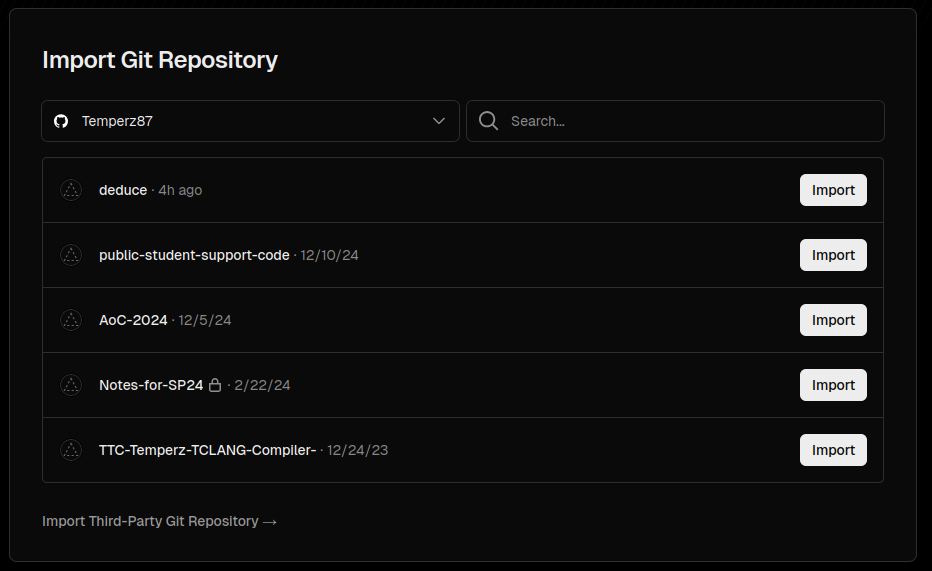
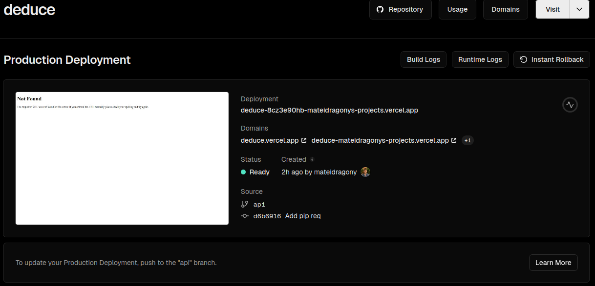

# How to setup deduce vercel api! 😀

Here's a step by step list of instructions on how to setup the deduce vercel api from scratch. After following these steps, every time you push to main, the api will be redeployed to vercel to ensure that the Live Code feature is always up to date.

## What are these new files in my repo??

For this vercel api to work, you will need the following files in your repository:

- `vercel.json` : This file includes the build configuration for vercel. It basically tells vercel how to build the api, and where the flask api file is and how to direct requests.
- `live_code_vercel_api/`
    - `api.py` : This is the actual code for the flask api. 
    - `requirements.txt`: These are the necessary pip packages for vercel. This one is separate from the root `requirements.txt` because vercel needs to install `flask` as well as `lark`.

## How to deploy on vercel

- Go to the [vercel site sign up page](https://vercel.com/signup) and create an account
- Make sure to select `Continue with GitHub` to connect your GitHub account to vercel
- Click the green `Authorize Vercel` button
- You should now see a page that looks like this:

> ⚠️ If you do not see your username under `Import Git Repository`, click on the arrow and find your username in the dropdown

- Find your deduce repository and click on the white `import` button.
- You should now see a page that looks like this:

- You can choose whatever name you want for `Project Name`, but it is recommended that you just use `deduce`
- The other settings can remain the same as they are set in the `vercel.json` file in the repository
- Click on `Deploy`

> 🎉 Congratulations! You just deployed the deduce api to vercel!

## Next steps

Now that the api is deployed on vercel, you just need to update the site to start requesting from your api.

- On vercel, copy one of the domains from the list of domains for your deployment

- Now go to the deduce repository and navigate to the `gh_pages/js/sandbox.js` file
- Find the line that says `const deduceServerURL = ".../deduce"` and replace the `...` with the domain that you copied from `vercel`

> ⚠️ You need to make sure that you append `/deduce` to the url that you paste in otherwise the api will not work. A correct example of a url would be `"https://deduce.vercel.app/deduce"` where `https://deduce.vercel.app` is what you copied from vercel.

That's all folks. Just push your change and the site should now be using your new api endpoint.

## Extra Resources

- [Vercel Docs](https://vercel.com/docs) (General docs)
- [Getting Started with Vercel](https://vercel.com/docs/getting-started-with-vercel) (More in-depth guide)
- [Vercel Limits](https://vercel.com/docs/limits/overview) (The hobby tier is the free tier)

### Good luck and Godspeed!
